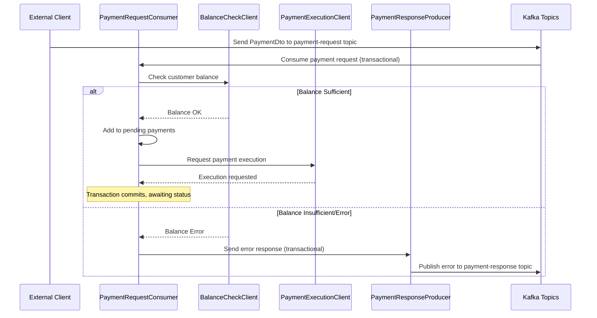
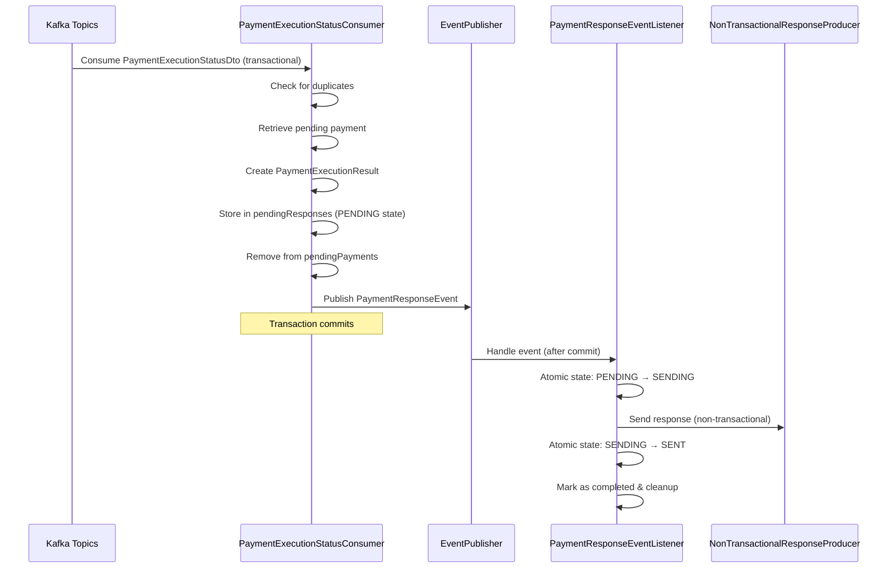

# Spring Kafka Lab - Payment Processing System

## Overview

This Spring Boot application demonstrates a robust payment processing system using Apache Kafka for message-driven architecture. The system implements a **strict "no retries" policy** to ensure resilience against poison pills while maintaining exactly-once processing semantics through transactional Kafka operations.

## Architecture

### Core Components

```
┌─────────────────┐    ┌──────────────────┐    ┌─────────────────────┐
│   Payment       │    │   Balance Check  │    │   Payment Execution │
│   Request       │───▶│   Client         │───▶│   Client            │
│   Consumer      │    │   (Simulation)   │    │   (Simulation)      │
└─────────────────┘    └──────────────────┘    └─────────────────────┘
         │                                                │
         ▼                                                ▼
┌─────────────────┐                              ┌─────────────────────┐
│   Payment       │                              │   Payment Execution │
│   Response      │                              │   Status Consumer   │
│   Producer      │◀─────────────────────────────│   (Status Handler)  │
│ (Transactional) │                              └─────────────────────┘
└─────────────────┘                                       │
                                                          ▼
                                                ┌─────────────────────┐
                                                │   Event Publisher   │
                                                │   (After Commit)    │
                                                └─────────────────────┘
                                                          │
                                                          ▼
                                                ┌─────────────────────┐
                                                │   Non-Transactional │
                                                │   Response Producer │
                                                └─────────────────────┘
```

### Kafka Topics

1. **payment-request**: Incoming payment requests
2. **payment-execution-status**: Status updates from payment execution
3. **payment-response**: Final payment responses

## Application Flow

### 1. Payment Request Processing



### 2. Payment Execution Status Processing



### 3. State Management & Resilience

The application uses atomic state transitions to ensure consistency:

- **PENDING**: Response ready to be sent
- **SENDING**: Response currently being sent
- **SENT**: Response successfully sent and completed

#### Retry Mechanisms

1. **Scheduled Retry Task**: Retries responses stuck in PENDING state
2. **Startup Recovery**: Processes pending responses on application restart
3. **State Recovery**: Resets SENDING state back to PENDING on failure

## Key Features

### 1. No Retries Policy

- **Resilience**: Prevents partition blocking from poison pills
- **Consistency**: Exactly one response per request guaranteed
- **Trade-off**: Temporary service failures result in permanent payment failures

### 2. Transactional Processing

- **Request Processing**: Uses transactional Kafka operations
- **Response Sending**: Separated into transactional consumption + non-transactional response
- **Event-Driven**: Responses sent after transaction commit via events

### 3. Concurrent Safety

- **ConcurrentHashMap**: Thread-safe collections for pending payments/responses
- **AtomicReference**: Atomic state transitions for response states
- **Compare-and-Set**: Lock-free atomic operations

### 4. Simulation Capabilities

Configure different error scenarios via `application.yml`:

```yaml
app:
  simulation:
    balance-check:
      simulate-insufficient-balance: false
      simulate-account-not-found: false
      simulate-service-unavailable: false
```

## Infrastructure Setup

### Kafka Cluster

The application uses a 3-broker Kafka cluster with:

- **Replication Factor**: 3
- **Min In-Sync Replicas**: 2
- **Partitions**: 3 per topic
- **Transaction Support**: Enabled with 120s timeout

### Running the Infrastructure

```bash
# Start Kafka cluster
docker-compose up -d

# Verify cluster health
docker-compose ps

# Access Kafdrop UI
http://localhost:19000
```

### Running the Application

```bash
# Build the application
./mvnw clean compile

# Run the application
./mvnw spring-boot:run

# Or run with specific profile
./mvnw spring-boot:run -Dspring-boot.run.profiles=dev
```

## Configuration

### Key Properties

```yaml
spring:
  kafka:
    bootstrap-servers: localhost:29092,localhost:29093,localhost:29094
    
app:
  kafka:
    topics:
      payment-request: payment-request
      payment-response: payment-response
      payment-execution-status: payment-execution-status
    producer:
      acks: "all"
      retries: 3
      enable-idempotence: true
      transactional-id: "payment-response-producer"
```

## Data Models

### PaymentDto
- `paymentId`: Unique payment identifier
- `customerId`: Customer identifier
- `amount`: Payment amount
- `currency`: Payment currency
- `paymentMethod`: Payment method (CREDIT_CARD, BANK_TRANSFER, etc.)
- `status`: Payment status
- `createdAt/updatedAt`: Timestamps
- `description`: Payment description

### PaymentExecutionStatusDto
- `paymentId`: Payment identifier
- `status`: Execution status (OK, ERROR)

### PaymentResponseDto
- Similar to PaymentDto with additional:
- `errorInfo`: Error details for failed payments

## Monitoring & Observability

### Logging

The application provides structured logging with:
- **Operation tracking**: Each step logged with operation type
- **Correlation IDs**: PaymentId used for request correlation
- **Error details**: Comprehensive error logging with context

### Metrics

Key metrics to monitor:
- Pending payments count
- Completed payments count
- Response sending failures
- State transition failures

## Testing

### Unit Tests

```bash
# Run all tests
./mvnw test

# Run specific test class
./mvnw test -Dtest=PaymentExecutionStatusConsumerTest
```

### Integration Testing

The application includes comprehensive tests for:
- Atomic state transitions
- Concurrent processing scenarios
- Error handling and recovery
- Event-driven response processing

## Business Implications

### No Retries Policy Impact

⚠️ **Important**: Due to the strict "no retries" policy:

- Temporary service outages result in **permanent payment failures**
- Business stakeholders should be aware of this trade-off
- Consider implementing business-level retry mechanisms outside this system
- Monitor external service availability closely

### Exactly-Once Processing

✅ **Guaranteed**: The system ensures:
- No duplicate payment processing
- Exactly one response per payment request
- Consistent state even during failures
- Recovery from application restarts

## Troubleshooting

### Common Issues

1. **Stuck Pending Responses**
   - Check scheduled retry task logs
   - Verify Kafka connectivity
   - Monitor state transition logs

2. **Transaction Timeouts**
   - Increase `transaction-timeout-ms` if needed
   - Check Kafka broker transaction settings
   - Monitor processing time

3. **Duplicate Processing**
   - Verify idempotent producer settings
   - Check consumer group configuration
   - Monitor completed payments tracking

### Health Checks

```bash
# Check Kafka cluster health
docker-compose exec kafka1 kafka-topics --bootstrap-server localhost:9092 --list

# Check application health
curl http://localhost:8080/actuator/health

# Monitor Kafdrop for topic status
http://localhost:19000
```

## Development

### Adding New Features

1. **New Payment Methods**: Extend `PaymentMethodEnum` in OpenAPI spec
2. **Additional Validations**: Add to DTO validation annotations
3. **New Error Types**: Create custom exception classes
4. **Monitoring**: Add custom metrics and logging

### Code Structure

```
src/main/java/ch/ruyalabs/springkafkalab/
├── client/           # External service clients (simulation)
├── config/           # Kafka and application configuration
├── consumer/         # Kafka consumers and producers
├── dto/              # Data transfer objects (generated)
├── event/            # Application events
├── exception/        # Custom exceptions
└── listener/         # Event listeners
```

This application demonstrates production-ready patterns for building resilient, transactional message-driven systems with Apache Kafka and Spring Boot.